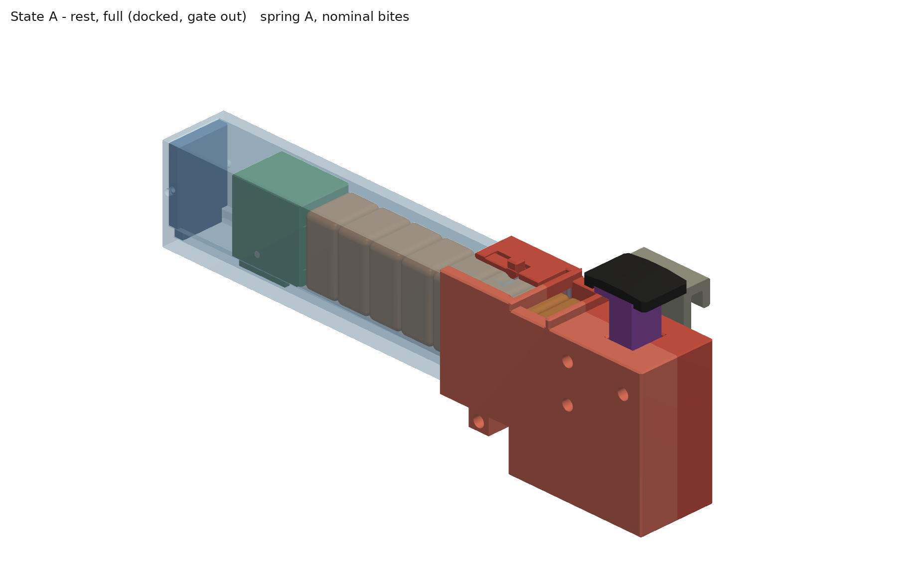

# EBD "Clip" v1: print-ready model

**Hickman High School CASA · NASA HUNCH 2026-27 · Extraterrestrial Bites Dispenser**
Team: Jessyn, Clayton, Esther. Built from `EBD_Build_Spec.md` Rev B (the spec wins over the Gameplan).



The Clip is a hands-free bite dispenser that sits inside the suit just below the helmet ring. A
constant-force spring pushes 8 bites along a tube (the **clip**) into a small head (the **receiver**).
Tuck your chin onto the **paddle** and a 1:1 **lever** lifts the front bite about 13.7 mm, so about 10 mm of
it sticks up through the **window** for your teeth. Let go and a return spring drops the cup back, and the
next bite slides on.

---

## 1. What's in this folder

| Folder / file | What it is |
|---|---|
| `stl/` | **Print these.** One STL per part, already turned to its print orientation and sitting on the bed. |
| `stl/*_springB.stl` | The parts that change for the lighter 0.33 lb spring B (follower, drum spacer rings). |
| `stl/assemblies/` | Whole-device STLs in each state (A, B, B′, C, D, D-taken, E) for viewing, not printing. |
| `step/parts/`, `step/assemblies/` | The same parts and states as STEP, for Fusion / Onshape / FreeCAD. |
| `renders/` | Pictures: iso, top and cut-away (section at Y = 0) views of the states, plus an exploded view. |
| `cad/` | The source code (CadQuery, Python). **`cad/params.py` holds every dimension.** |
| `VERIFICATION.md` | The §9 acceptance checks with the measured numbers (run automatically). |
| `CHANGES.md` | Every place the model differs from the spec, and why. |
| `OPEN_ISSUES.md` | Problems in the spec and decisions the team still has to make. **Read this.** |

## 2. Print the fit coupon FIRST, then set `CLR_SLIDE`

1. Print `stl/fit_coupon.stl` (PETG, same settings as below). It has a plate with four square sleeves, five
   pin-hole sizes, and a separate 10 × 10 slider bar.
2. **Sleeves** (dots next to each: 1 dot = 0.20, 2 = 0.25, 3 = 0.30, 4 = 0.35 mm clearance per side). Push the
   slider through each one. Pick the **tightest sleeve the slider slides through freely by hand without
   wobbling**. That number is your `CLR_SLIDE`.
3. **Pin holes** (1 dot = Ø1.9 … 5 dots = Ø2.3; top row vertical, side row horizontal). Try a piece of your
   Ø2 steel rod in each. You want one that **presses in and stays** (press), one that **pushes in snugly**
   (snug) and one that **spins freely** (free). The defaults are 1.9 / 2.1 / 2.3.
4. Edit `cad/params.py` if your printer needs different values, then rebuild (section 7). `CLR_SLIDE` sets every
   sliding fit and the free pin hole (Ø2 + `CLR_SLIDE`); `CLR_PRESS` sets the press (Ø2 − `CLR_PRESS`), snug and
   running (both Ø2 + `CLR_PRESS`) pin holes. The lever's pivot hole must be a *running* fit: the pin spins
   freely without wobble. The follower's axle holes print horizontal: use the coupon's side row for them.

## 3. Print settings and orientation

**PETG, 0.4 nozzle, 0.2 layers, 4 perimeters, 30 % gyroid.** Paddle pad in **TPU 95A**. The STLs are
already in the orientation below; just drop them on the bed.

| File | Qty | Material | Bed face (already oriented) | Supports | Notes |
|---|---|---|---|---|---|
| `clip_tube.stl` | 1 | PETG, **translucent** if you have it | bottom (−Z) | none | The roof is a 20.5 mm bridge 0.3 above the follower. After printing, check the roof underside with a straightedge: if it sags more than 0.2, see OPEN_ISSUES #7. For opaque filament use `clip_tube_viewslots.stl` (9 small windows so you can count bites). |
| `gate.stl` | 1 | PETG | flat | none | |
| `end_cap.stl` | 1 | PETG | flat (outer face) | none | |
| `follower.stl` | 1 | PETG | rear face | none | Spring B: print `follower_springB.stl` instead (smaller coil pocket). |
| `drum.stl` | 1 | PETG | on its end | none | |
| `drum_spacer_springB.stl` | 2 | PETG | flat | none | **Spring B only.** Rings that slip over the drum, one each side of the narrow coil. |
| `ribbon_clamp.stl` | 1 | PETG | top face (ridge up) | none | |
| `receiver_left.stl` | 1 | PETG | split face | **YES**: see below | The −Y half: mount face, dowel press holes, nut traps, and the latch. |
| `receiver_right.stl` | 1 | PETG | split face | **YES**: see below | The +Y half: screw counterbores, gate-tab channel. |
| `elevator.stl` | 1 | PETG | bottom | none | |
| `lever.stl` | 1 | PETG | on its side | none | All three holes print vertical (round). |
| `plunger.stl` | 1 | PETG | **upside down** (flange on the bed) | **YES**: enforcer `stl/slicer_helpers/plunger_SUPPORT_ENFORCER.stl` (under the ear only) | Brim. |
| `paddle_pad.stl` | 1 | **TPU 95A** | on its side | none | Print slowly, with a brim. |
| `ring_hook.stl` | 1 | PETG | on its end | none | Placeholder size until the neck ring is measured (OPEN_ISSUES #4). |
| `bench_base.stl` | 1 | PETG or PLA | flat | none | Holds the device upright on the bench. |
| `bite_nominal.stl`, `bite_min.stl`, `bite_max.stl` | 8 of each | PETG or PLA | flat | none | Dummy bites for testing: 12.7 × 19 × 25.4, 12.2 × 18 × 24.4, 13.2 × 20 × 26.4. |
| `fit_coupon.stl` | 1 | PETG | flat | none | Print first (section 2). |

**Supports (receiver halves and plunger):** in the slicer, load each part's `stl/slicer_helpers/<part>_SUPPORT_ENFORCER.stl`
as a *support enforcer* modifier on that part (it lines up automatically), set supports to **enforcers only**, and
add a brim. In the preview, supports should appear only:
- inside the U-shaped socket opening (the part the clip slides into)
- under the thin roof strip beside the gate-tab channel (right half only)
- under the plunger's spring ear

Nothing else gets support. In particular, the bite-channel side wall next to the socket prints as a 27 mm
bridge on purpose, because support there would scar the elevator's sliding face.

Remove the supports with pliers and a hobby knife, then **file the socket's inner side faces smooth**: the clip
slides there with only 0.3 mm clearance. Then **dry-fit the elevator and a max-size dummy bite** in each half's
bite channel and scrape any sag on that bridged wall. Why supports are needed: OPEN_ISSUES #2.

## 4. Hardware (BOM)

| Qty | Item | Used for |
|---|---|---|
| 1 | Constant-force spring **A** 1.48 lb (SUS301, 0.38″ wide) | Bite feed (first tests) |
| 1 | Constant-force spring **B** 0.33 lb (0.25″ wide), **recommended final** | Bite feed (lower chin force, uneaten bite sinks back) |
| 1 | Compression spring OD 5.5-6.5, free length 34-36, ≈ 0.20 N/mm (≈ 0.12 N/mm for spring B) | Return spring |
| ~1 m | Ø2.0 steel rod / music wire, cut to: pivot **26.0**, cup-end **19.4**, plunger-end **11.4**, drum axle **19.9**, dowels **3 × 10** | Pins (file the ends flat and deburr) |
| 2 | M2 × 4 countersunk self-tapping | Ribbon clamp |
| 2 | M2 × 6 pan-head self-tapping | End cap |
| 4 + 4 | **M2 × 20** socket or pan head + M2 nuts (a drop of medium threadlocker) | Receiver halves |
| 2 | M2 × 8 **countersunk** self-tapping | Ring hook |
| 2 + 2 | M3 thumb screws + M3 nuts | Bench base |
| - | **Adhesive-backed** PTFE film 0.08 mm, industrial Velcro 2″, CA glue, Ø2 drill in a pin vise, 1.5 mm hex key, cut-off wheel for music wire (or buy Ø2 × 10 dowel pins) | |

## 5. Assembly order

### Clip (cartridge), spec §5.7

0. **Tip:** with spring A, park the pulled-out coil with a binder clip at the back of the tube during steps 2–4. Spring B is much easier to handle.
1. **Clamp the ribbon.** Lay the free end of the spring ribbon flat in the groove at the mouth, centred
   between the two screw holes. Put the clamp on it with the **ridge down** over the little notch in the
   groove floor. Drive the two **M2 × 4 countersunk** screws up from underneath the tube into the clamp. The
   heads must end flush or below the bottom.
2. **Thread the coil through.** Pass the coil back along the groove and out of the back of the tube.
3. **Coil onto the drum.** Slip the coil onto the drum by hand; its own preload grips it. *Spring B:* first
   slide a spacer ring onto each end of the drum so the narrow coil sits centred between them.
4. **Drum into the follower.** Drop drum + coil into the follower's pocket **from below**, through the open
   slot between the keel legs. The ribbon must come off the **bottom** of the coil and head toward the
   follower's front (push-rib) end. Push the 19.9 mm axle through the side holes and the drum. It ends flush
   with the follower sides; the tube walls keep it in.
5. **Follower into the tube.** Slide the follower in from the back, keel in the groove and the ribbon flat
   between the keel legs. Let the spring pull it forward gently; don't let it snap.
6. **End cap.** Push the end cap in (tongue in the groove) and drive the two **M2 × 6 pan-head** screws
   through the side-wall holes.

### Receiver (head)

1. Clean off the supports. Check the latch tongue flexes freely (run a knife through its 1.0 cuts if needed).
   Dry-fit the elevator, the plunger and a max-size dummy bite in each half, and file or scrape any tight
   channel face. Press the **3 dowels** into the Ø1.9 holes of the **left** half with a vise (they stick out
   about 5 mm).
2. Put **PTFE tape** on the elevator's front and rear faces and on the front-wall stop face (the flat wall at
   the front of the window) in both halves.
3. Drop an **M2 nut** into each of the 4 hex traps on the left half's outer face and hold it with a strip of
   masking tape. The M2 × 20 screws reach a nut anywhere in its trap and pull it in as you tighten.
4. Ream the lever's **centre** hole with a Ø2.1 drill in a pin vise until the lever spins freely on a Ø2 pin
   without wobble (the two end holes stay snug). Lay the left half split-face up. **Press** the **26.0 pivot
   pin** into its Ø1.9 hole with the vise, all the way to the bottom, like the dowels. Then slip the
   **lever** onto it.
5. Put the **elevator** in its channel, sitting on the ledge, with the lever's end inside the elevator's
   front notch. Push the **19.4 cup-end pin** through the elevator slot and the lever end.
6. Put the **plunger** in its channel with the ear in the ear slot and the lever's other end in the
   plunger's notch. Push the **11.4 plunger-end pin** through.
7. Stand the **return spring** in its well under the ear, with the spigot inside the spring.
8. Close with the **right** half (the dowels and pivot pin line it up). Put the four **M2 × 20** screws in from
   the right side (they sit 9 mm deep in their counterbores; use a long driver) and tighten into the nuts.
9. **Test:** press the plunger down to its stop (about 14.9 mm of travel). The cup should rise about 13.9 mm and
   fall back when you let go.
10. Scuff the flange top with sandpaper, then CA-glue the **TPU pad** onto it: the pad's two end rims go over
    the flange ends.
11. Screw the **ring hook** onto the left (mount) face with 2 × **M2 × 8 countersunk**. Add Velcro
    (OPEN_ISSUES #4).

### Load, dock, arm, undock

- **Load (one bite at a time, using the gate as a ratchet):** with the gate in, hold the next bite at the mouth
  and lift the gate out. Push the bite in about 3 mm past the gate slot with a pencil held low in the mouth.
  Slide the gate down until it rests on the pencil, pull the pencil out, and push the gate fully down. Repeat for
  each bite. **Keep eyes away from the mouth: spring A can fire a bite out.** Spring B makes this much easier.
  The gate's tab points to the right (+Y) side. Tie a short lanyard through its hole so it doesn't get lost on
  the bench; the gate is not used during an EVA.
- **Dock:** with the gate **in**, slide the clip into the socket so the gate's tab runs in the slot in the
  socket roof. Push until the latch clicks (the clip mouth meets the stop face).
- **Arm:** pull the gate straight up out of the socket.
- **Undock:** only when the clip is empty (OPEN_ISSUES #6). Lift the latch tab and pull the clip out.

## 6. How it's checked

`VERIFICATION.md` is written by `cad/verify.py`. It rebuilds every state at min / nominal / max bite size
for both springs and checks every pair of parts for overlap with exact solid booleans. It sweeps the lever
through 7 in-between angles, measures clearances, exposure, spring extension and slot margins, checks every
STL is watertight with walls ≥ 0.8, finds overhangs, and reports mass and chin force. Current status: **§9.1–9.7,
9.9 and 9.10 pass. §9.8 is flagged**: the receiver halves and the plunger need support in known places
(enforcers supplied), and one bite-channel wall is a 27 mm bridge against the 25 mm rule (OPEN_ISSUES #2).

## 7. Changing the design

All dimensions live in **`cad/params.py`** with the spec's names (`BITE_T`, `CLR_SLIDE`, `LIFT`,
`SPRING_W`, `PADDLE_X`, `RING_FLANGE_T`, …). Nothing is typed twice. After an edit:

```bash
pip install cadquery trimesh manifold3d embreex networkx shapely matplotlib vtk
cd cad
python build_all.py            # STLs, STEPs, renders, VERIFICATION.md, zip (~10 min)
python build_all.py --quick    # nominal bites + spring A only (~3 min)
```

(On Linux without a screen, renders need `xvfb-run`; `build_all.py` uses it automatically.)

Common edits:
- **Real bites (Esther's trials):** change `BITE_T`, `BITE_W`, `BITE_H` and the tolerances. The ±0.5 on
  `BITE_T` is a MUST: it stops the elevator lifting two bites.
- **Real spring:** edit its row in `SPRINGS` (force, width, thickness, length). The pocket size and spacer
  rings follow automatically.
- **Reach test (`PADDLE_X`):** the pivot, `LEVER_R`, plunger, channels, slot lengths, dowel and ring hook all
  follow. Moving the paddle up to 10 mm **further** from the window passes every check. Moving it **closer**
  only works to about 7 mm (`PADDLE_X` ≥ −29), because the pad then runs into the window (OPEN_ISSUES #11).
- **Neck ring:** set `RING_FLANGE_T`, `RING_HOOK_REACH`, `RING_HOOK_Z` after measuring `HUT – Largest.stl`.
